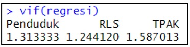

# 📈Analisis Faktor-Faktor yang Mempengaruhi Tingkat Kemiskinan di Jawa Barat Menurut Kabupaten/Kota Tahun 2024

  

# Latar Belakang
Tingkat Pengangguran Terbuka (TPT) merupakan salah satu indikator utama yang mencerminkan kondisi ekonomi dan ketenagakerjaan di suatu daerah. Di Provinsi Jawa Barat, angka TPT cenderung lebih tinggi dibandingkan provinsi lain di Indonesia menurut data BPS. Kondisi ini menunjukkan adanya ketidakseimbangan antara pertumbuhan penduduk, ketersediaan lapangan kerja, serta kualitas tenaga kerja. Oleh karena itu, penting dilakukan analisis untuk mengetahui faktor-faktor yang memengaruhi tingkat pengangguran terbuka di provinsi ini.

Beberapa variabel yang diperkirakan berpengaruh terhadap TPT antara lain laju pertumbuhan penduduk, rata-rata lama sekolah, dan tingkat partisipasi angkatan kerja (TPAK). Pertumbuhan penduduk yang cepat dapat meningkatkan jumlah pencari kerja, sementara pendidikan (lama sekolah) diharapkan menurunkan pengangguran dengan meningkatkan kualitas tenaga kerja. Di sisi lain, TPAK yang tinggi menunjukkan semakin banyak penduduk usia kerja yang aktif di pasar tenaga kerja, yang bisa berdampak positif maupun negatif terhadap tingkat pengangguran tergantung pada kemampuan penyerapan kerja.

Untuk menganalisis hubungan antarvariabel tersebut, penelitian ini menggunakan pendekatan regresi linier dengan bantuan perangkat lunak R. Pendekatan ini didasarkan pada buku “Introduction to Machine Learning Using R: Konsep, Teori, dan Praktik” karya Lukmanul Hakim dan Asep Saefuddin (2022), yang menjelaskan penerapan konsep machine learning dasar dalam pemodelan regresi menggunakan R. Buku tersebut menekankan pentingnya pemrosesan data, validasi model, serta interpretasi hasil secara komputasional dan statistikal untuk mendukung analisis kuantitatif berbasis data dalam penelitian sosial ekonomi.

# 📋Sumber Data dan Variabel

  

## Variabel Prediktor (X):
<ul>
  <li> Tingkat Partisipasi Angkatan Kerja (%) </li>
  <li> Laju Pertumbuhan Penduduk (%) </li>
  <li> Rata-Rata Lama Sekolah (%) </li> 
</ul>

## Variabel Respon (Y):
Tingkat Pengangguran Terbuka (%)

# 📊Visualisasi Data

## 1. Barchart TPT

  

Grafik Tingkat Pengangguran Terbuka (TPT) menunjukkan bahwa Kota Cimahi, Kabupaten Bekasi, dan Kota Sukabumi mencatatkan TPT tertinggi  di atas 7,5%. Sebaliknya, kabupaten seperti Pangandaran dan Ciamis memiliki TPT terendah di bawah 4%. Pada kabupaten Pangandaran, TPT yang rendah ini sejalan dengan Tingkat Partisipasi Angkatan Kerja (TPAK) yang sangat tinggi di daerah tersebut, Hal ini mengindikasikan bahwa di derah ini  mayoritas penduduk usia kerja aktif dan terserap dengan baik.

## 2. Barchart TPAK

  

Berdasarkan grafik Tingkat Partisipasi Angkatan Kerja (TPAK) di Kabupaten/Kota Jawa Barat, menunjukkan bahwa Pangandaran memimpin dengan TPAK tertinggi yaitu 80% diikuti oleh kabupaten seperti Cianjur dan Subang. Hal ini mengindikasikan tingginya keterlibatan penduduk usia kerja dalam kegiatan ekonomi di wilayah-wilayah yang cenderung merupakan kawasan agraris atau pedesaan. Di sisi lain, kota-kota besar dan metropolitan seperti Kota Depok dan Kota Sukabumi mencatatkan TPAK terendah dengan nilai di bawah 70%.

## 3. Barchart RLS

  

Grafik Rata-Rata Lama Sekolah (RLS) di berbagai Kabupaten/Kota di Jawa Barat, menunjukkan bahwa kota-kota besar dan metropolitan seperti Kota Bekasi, Kota Depok, dan Kota Cimahi menempati posisi teratas dengan RLS tertinggi rata-rata 11 tahun. Hal ini mengindikasikan bahwa rata-rata penduduk di daerah tersebut telah menempuh pendidikan setara SMA atau lebih. Sebaliknya, wilayah-wilayah seperti Kabupaten Subang, Sukabumi dan Indramayu berada di posisi terbawah dengan RLS lebih rendah yaitu di bawah 8.0 tahun yang mengindikasikan bahwa rata-rata penduduknya hanya memiliki pendidikan setara SMP atau di bawahnya.

## 4. Barchart Penduduk

  

Grafik rata-rata laju pertumbuhan penduduk di berbagai kabupaten/kota di Provinsi Jawa Barat, menunjukkan bahwa Kota Sukabumi, Kabupaten Bandung Barat, dan Kota Cimahi menempati posisi dengan laju pertumbuhan penduduk tertinggi dengan nilai pertumbuhan penduduk rata-rata 1,4%. Hal ini mungkin didorong oleh tingginya urbanisasi dan migrasi masuk seiring perkembangan wilayah tersebut menjadi pusat ekonomi. Sedangkan, daerah seperti Kabupaten Sumedang, Pangandaran, dan Ciamis berada pada posisi terbawah dengan laju pertumbuhan penduduk yang relatif rendah di bawah 1%.

# ⚙️Uji Asumsi
## 1. Uji Normalitas

  

Uji normalitas berfungsi untuk menguji apakah nilai residual dalam model regresi memiliki distribusi normal atau tidak. Berdasarkan plot Normal Q-Q, dapat diketahui bahwa mayoritas sebaran data berada di sekitar garis lurus yang mengindikasikan bahwa data tersebut berdistribusi normal. Meskipun demikian analisis visual bersifat subjektif, maka diperlukan uji statistik seperti Shapiro-Wilk untuk memperoleh kesimpulan yang lebih objektif.

  

Pengujian normalitas dilakukan menggunakan Shapiro – Wilk karena jumlah data yang digunakan dalam penelitian ini adalah < 50. Berdasarkan hasil uji tersebut diperoleh nilai 𝑝 − 𝑣𝑎𝑙𝑢𝑒 (0.4881) > 𝛼 (0.05). Hal ini berarti bawa residual menyebar normal dan asumsi normalitas terpenuhi.

## 2. Uji Multikolinearitas

  

Uji multikolinearitas bertujuan untuk menguji apakah dalam model regresi terdapat korelasi antar variabel independen. Salah satu cara yang digunakan untuk mendeteksi adanya multikolinearitas adalah mengecek nilai VIF. Hasil uji multikolinearitas diperoleh nilai VIF masing-masing variabel yaitu Penduduk (1,313), RLS (1,244), TPAK (1,587) < 5. Hal ini berarti tidak terjadi multikolineritas atau asumsi multikolinearitas terpenuhi.

## 3. Uji Heteroskedastisitas

  

Uji heterosekedastisitas bertujuan untuk melihat apakah dalam model regresi terjadi ketidaksamaan varians dari residual satu pengamatan ke pengamatan yang lain. Jika varians dari nilai residual antar pengamatan tetap maka disebut homokedastis. Akan tetapi jika berbeda, maka disebut heteroskedastisitas. Model regresi yang baik adalah model yang bersifat homokedastis. Berdasarkan uji Breusch Pagan Godfrey diperoleh nilai 𝑝 − 𝑣𝑎𝑙𝑢𝑒 (0.4251) > 𝛼 (0.05). Hal ini berarti bahwa tidak terdapat indikasi heteroskedastisitas atau asumsi uji heteroskedastisitas sudah terpenuhi.

# 🎯Hasil Analisis Regresi Berganda
Pengolahan dengan analisis Regreasi Berganda memperoleh hasil sebagai berikut.

  

Berdasarkan hal tersebut, dapat diinterpretasikan hal-hal sebagai berikut.

## 1. Uji Overall (Uji F)
Dari tabel diperoleh hasil uji signifikansi model secara keseluruhan:
<ul>
 <li><em>F-statistic</em>: 11.63</li>
 <li><em>p-value</em>: 7.709e-05</li> 
</ul>	

Nilai *p-value* yang sangat kecil (7.709e-05), jauh di bawah tingkat signifikansi umum α = 0.05 menunjukkan bahwa hipotesis nol (H0) yang menyatakan semua koefisien variabel independen (Penduduk, RLS, TPAK) secara bersama-sama sama dengan nol ditolak. 

Kesimpulannya: 
Model secara statistik menyatakan bahwa setidaknya ada satu variabel independen (Penduduk, RLS, atau TPAK) yang berpengaruh secara signifikan terhadap variabel dependen TPT.

## 2. Uji Parsial (Uji t)
Ini menguji pengaruh masing-masing variabel independen terhadap variabel dependen secara individu, dengan asumsi variabel lain konstan, dan α = 0.05.

a.	Variabel: Penduduk
<ul>
 <li><em>Estimasi Koefisien</em>: 3.22454</li>
 <li><em>	p-value</em>:  0.00643 </li> 
</ul>	
p-value (0.00643) < 0.05, ➜ variabel Penduduk berpengaruh positif dan signifikan terhadap TPT.
•	Artinya: 
Jika variabel RLS dan TPAK konstan, maka setiap kenaikan 1 unit pada Penduduk akan meningkatkan TPT sebesar 3.22454 unit.

b.	Variabel: RLS
<ul>
 <li><em>Estimasi Koefisien</em>: 0.25801</li>
 <li><em>	p-value</em>:  0.18278 </li> 
</ul>	 
p-value (0.18278) > 0.05 ➜ variabel RLS berpengaruh tidak signifikan terhadap TPT.
•	Artinya: 
Tidak ada bukti statistik yang cukup untuk menyatakan bahwa RLS memiliki pengaruh terhadap TPT dalam model ini.

c.	Variabel: TPAK
<ul>
 <li><em>Estimasi Koefisien</em>: -0.17110</li>
 <li><em>	p-value</em>:  0.04839 </li> 
</ul>	 
p-value (0.04839) < 0.05 ➜ variabel TPAK berpengaruh negatif dan signifikan terhadap TPT.
•	Artinya: 
Jika variabel Penduduk dan RLS konstan, maka setiap kenaikan 1 unit pada TPAK akan menurunkan TPT sebesar 0.17110 unit.

## 	3. Persamaan Model Regresi
Berdasarkan nilai Estimate tersebut, maka persamaan regresi yang terbentuk adalah:

$$
\text{TPT} = 12.22880 + 3.22454 \cdot \text{Penduduk} + 0.25801 \cdot \text{RLS} - 0.17110 \cdot \text{TPAK}
$$

Secara keseluruhan, model ini layak digunakan (signifikan) dan mampu menjelaskan 55.09% keragaman TPT. Variabel yang terbukti berpengaruh signifikan terhadap TPT adalah Penduduk (pengaruh positif) dan TPAK (pengaruh negatif). Variabel RLS tidak terbukti berpengaruh signifikan dalam model ini.

# 🔗Hasil Uji Korelasi

## 1. TPT vs Laju Pertumbuhan Penduduk

  

<ul> <li><strong>Koefisien Korelasi (cor) = 0.649 (positif)</strong>  Artinya terdapat hubungan searah antara Penduduk dan TPT. 
 &gt; Jika Penduduk meningkat, maka TPT juga cenderung meningkat.  &gt; Nilai korelasi 0.649 menunjukkan hubungan linear cukup kuat (atau sedang). 
 </li> <li><strong>p-value = 0.0002497 &lt; 0.05</strong>  Artinya H0 ditolak → terdapat hubungan linear yang signifikan antara Penduduk dan TPT. </li> <li><strong>Selang Kepercayaan (95%) = 0.3571215 sampai 0.8254657</strong>  Rentang tidak mencakup 0 → hubungan signifikan. </li> </ul>

## 2. TPT vs RLS

  

<ul> <li><strong>Koefisien Korelasi (cor) = 0.421 (positif)</strong>  Artinya terdapat hubungan searah antara RLS dan TPT. 
 &gt; Jika RLS meningkat, maka TPT cenderung meningkat.  &gt; Nilai korelasi 0.421 menunjukkan hubungan linear yang lemah. 
 </li> <li><strong>p-value = 0.028767 &lt; 0.05</strong>  Artinya H0 ditolak → terdapat hubungan linear signifikan antara RLS dan TPT. </li> <li><strong>Selang Kepercayaan (95%) = 0.049 sampai 0.691</strong>  Rentang tidak mencakup 0 → hubungan signifikan. </li> </ul>

## 3. TPT vs TPAK

  

<ul> <li><strong>Koefisien Korelasi (cor) = -0.652 (negatif)</strong>  Artinya terdapat hubungan berlawanan arah antara TPAK dan TPT. 
 &gt; Jika TPAK meningkat, maka TPT cenderung menurun.  &gt; Nilai korelasi -0.652 menunjukkan hubungan linear cukup kuat. 
 </li> <li><strong>p-value = 0.0002307 &lt; 0.05</strong>  Artinya H0 ditolak → terdapat hubungan linear signifikan dan kuat. </li> <li><strong>Selang Kepercayaan (95%) = -0.8269401 sampai -0.3611676</strong>  Rentang tidak mencakup 0 → hubungan signifikan. </li> </ul>

## 4. Kesimpulan
<ul> <li>Ketiga variabel (Penduduk, RLS, TPAK) memiliki hubungan linear yang signifikan terhadap TPT.</li> <li>Hubungan terkuat: <ul> <li>TPAK → TPT (korelasi negatif kuat)</li> <li>Penduduk → TPT (korelasi positif kuat)</li> </ul> </li> <li>Variabel RLS memiliki hubungan yang lebih lemah dibanding dua variabel lain.</li> </ul>
